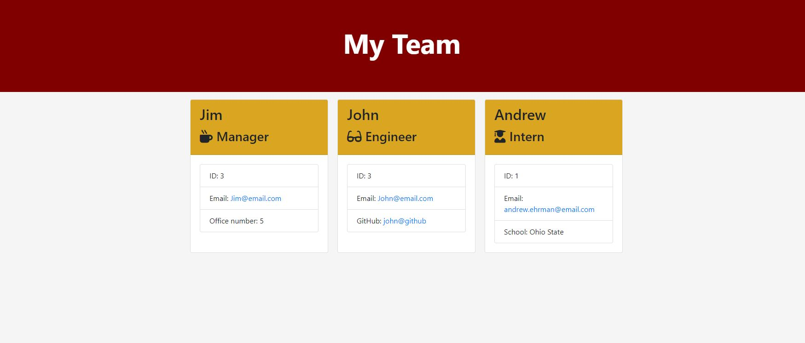

# ProfileGenerator

## Table of Contents
[Description](#description)

[Installation](#installation)

[Usage](#usage)

[Credits](#credits)

## Description
This repository contains a command line program that genrates a html page. The command line asks employee information from a manager as a user. The once the information is entered the program generates a styled html page that displays the entered information based on inputed information. The output folder contains and example of this html. The following is a screenshot of the compiled html.

## Installation
Downloading respository. In directory run npm install.

## Usage
After installation run node app.js. The user is then prompted to input employee information. Once finished the program wil generate a html page containing the inputed information.

## Credits
Made By Andrew Ehrman.

### Components Used
Node

npm packages
jest
inquirer

